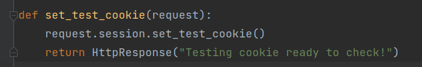
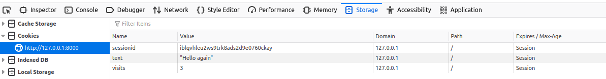
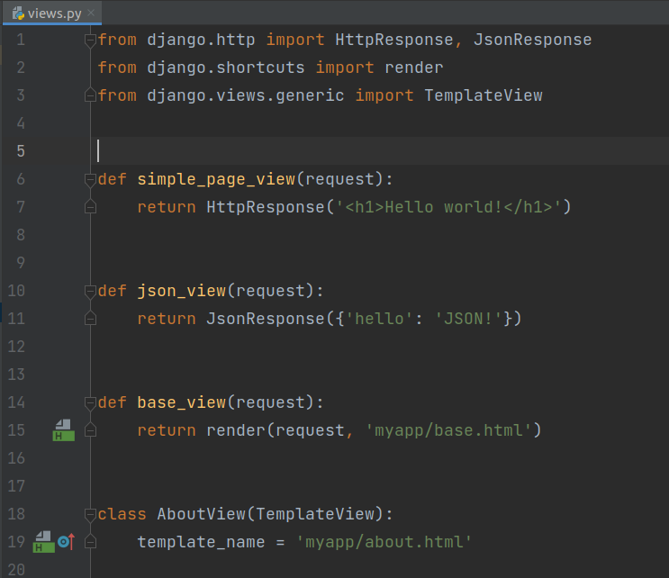
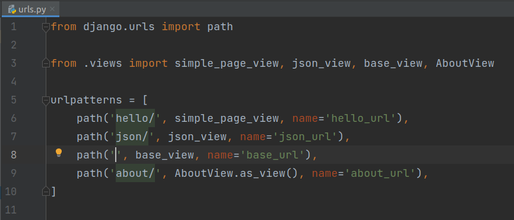
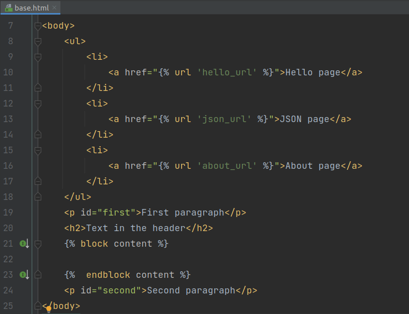
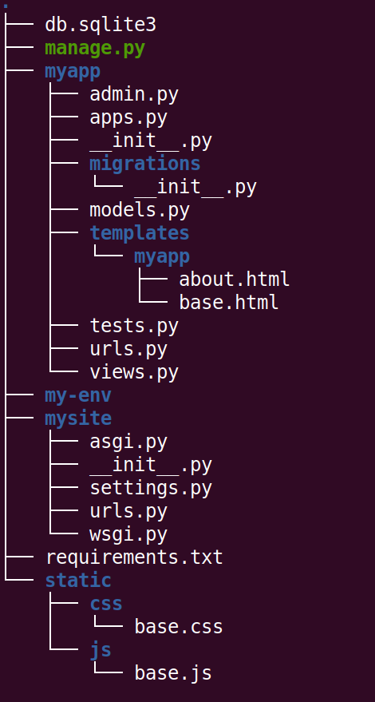
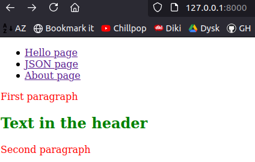

# Sessions and cookies in Django  

## Tasks
1. So far we have created virtual environment inside 'django-exercise' folder and we have project named 'mysite' with app named 'myapp'.  
*  App handles few urls, and each url allows user for calling specific view.  
*  Views return response objects (HttpRespons or JsonResponse) with hardcoded values or convenient functions for both function based views (FBV) and class based views (CBV) are used. 
* Templates, template tags and variables, template extending work in appropriate way.

*  **Don't forget to activate you virtualenv!**  

2. Session availability in Django.
*  Check if you have session functionality available in your project: in ```settings.py``` configuration file you should have  ```django.contrib.sessions.middleware.SessionMiddleware``` specified in the MIDDLEWARE list.
* to store session information in a Django model/database (will be covered later) the most straightforward approach is to use the ```django.contrib.sessions``` application (check the INSTALLED_APPS list).

     

2. Working with cookies 
* our database ```db.sqlite3``` is empty and without tables. In order to work with sessions (and many other things) in Django we must create proper tables. Luckily, Django will do it for us using ORM (Object-Relational Mapping) and 'migrations' (this topics will be covered later). If you don't do it, you can encounter errors like this:  
      

* to do this, simply stop development server and run command: ```python manage.py migrate```.      
      
* after proper execution of this command you shouldn't see warnings about migrations mentioned earlier. 

* check if your browser supports cookies by modifying [example](https://docs.djangoproject.com/en/3.2/topics/http/sessions/#setting-test-cookies) from documentation:
   * add view ```set_test_cookie```, that uses built-in function with the same name and don't forget to return HttpResponse in this view!
      
   * add url ```set-test-cookie``` for this view in app-level ```urls.py``` and remember about importing this view earlier!
      
   * in browser open link ```http://127.0.0.1:8000/set-test-cookie/``` to set the testing cookie,
   * add view ```check_test_cookie``` that uses ```test_cookie_worked()``` function and ```delete_test_cookie()``` function.
      
   * add url ```check-test-cookie``` for this view in app-level ```urls.py``` and remember about importing this view earlier!
         
   * in browser open link ```http://127.0.0.1:8000/check-test-cookie/``` to check the testing cookie,
         

3. Managing your own cookies.
* documentation about [setting own cookies](https://docs.djangoproject.com/en/3.2/ref/request-response/#methods) in Django (scroll to ```set_cookie()``` method),

* Django’s request object has an attribute COOKIES (available via ```request.COOKIES```), which behaves like standard dictionary. You can  use dictionary's methods like for example [get](https://www.geeksforgeeks.org/get-method-dictionaries-python/),  

* add view ```set_own_cookie``` that checks if we have set cookie named ```visits```:
   * if yes then increase (+1) value for this cookie and set value ```Hello, again``` for second cookie named ```text```.  
   * if not set value of this cookie on 1 and set value ```Welcome for the first time``` for second cookie named ```text```
      

* Hint: cookie's values are always strings, so remember about casting!  [ex]
* add url ```set-own-cookie``` for this view in app-level ```urls.py``` and remember about importing this view earlier!
         
* in browser open link ```http://127.0.0.1:8000/set-own-cookie/``` to check setting cookies,  and open 'Storage' tab in browser's Web Development Tools
         
* Values of cookies ```visits``` and ```text``` clearly inform us about first visit on this page. But after another visits, the values of cookies are different:
         


* The ```sessionid``` cookie contains a series of letters and numbers which Django uses to uniquely identify your session. From there, all your session details can be accessed - but only on the server side. Django uses this cookie to look up the session in the database where it stores all the server side cookies about that session.

4. Reading and Writing Session Data.  
* more secure way to save session information is to store any such data on the server side. We can then use the ```sessionid``` cookie which is stored on the client side (but is effectively anonymous) as the key to unlock the data.

* a ```sessionid``` cookie is still used to remember the client’s machine (so technically a browser side cookie exists), however all the data is stored serve side.

* add another  function based view (named for example ```base_view```), that uses [render](https://docs.djangoproject.com/en/3.2/topics/http/shortcuts/#render) function with previously created template ```base.html```,
* add class based view (named for example ```AboutView```), that uses previously created template ```about.html```,
*  Hint: you can use [TemplateView](https://docs.djangoproject.com/en/3.2/topics/class-based-views/).

   

5. Update your app-level ```urls.py```. Import created views and create two different paths (for both views, for example '' and 'about/'):    
   

6. Run development server to check if recently added added urls work:  
```python manage.py runserver```  

*  Check links ```http://127.0.0.1:8000/``` and ```http://127.0.0.1:8000/about/``` in the browser.   You should see something similar to following picture:

     

7. In the ```base.html``` template add links to other created pages using [url](https://docs.djangoproject.com/en/3.2/ref/templates/builtins/#url) template tag:

    

*  the page could look like this:  
    

8. Adding static files to project:
*  create folder ```static``` at the project level and create two folders inside it: ```css``` and ```js```.  
In ```css``` folder create ```base.css``` file and in ```js``` folder create ```base.js``` file:  
 

* add information about ```static``` folder to setting [STATICFILES_DIRS](https://docs.djangoproject.com/en/3.2/ref/settings/#std:setting-STATICFILES_DIRS) in ```settings.py``` configuration file.  
 

  Some useful hints could be found [here](https://adamj.eu/tech/2020/03/16/use-pathlib-in-your-django-project/).

* in ```base.css``` add rule for changing color of all (or selected) paragraphs to red. 
 

* in ```base.js``` add rule for changing color of all (or selected) specific headers to green. 
 

* if everything works fine, you should see effects of your changes:
 

## Input/Output:
```
Working urls, views and templates with static (CSS and JavaScript) files.
```