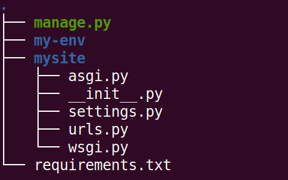
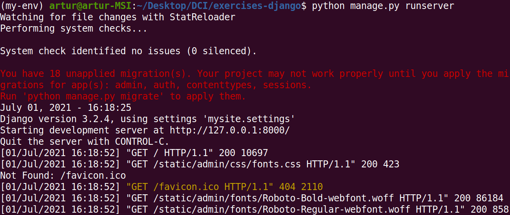
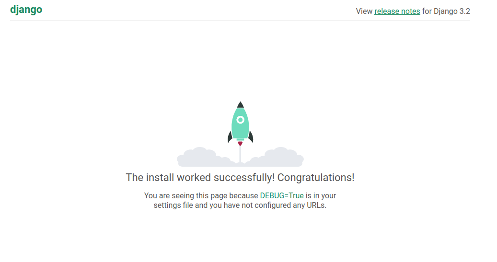

# Start new empty project in Django 

## Tasks
1. In terminal create directory 'exercises-django' and get into it:  
```mkdir exercises-django```  
```cd exercises-django/```  

   **For all exercises you'll need only this one folder!**

2. Create virtual environment with name suggested by teacher (for example 'my-env'):  
```python3 -m venv my-env```  

3. Activate virtualenv:  
```source my-env/bin/activate```   
After activation of virtualenv you should see in console its name in parentheses, for example: 
   >(my-env) artur@artur-MSI:~/Desktop/DCI/exercises-django$

4. Install Django in this virtualenv:  
```pip install Django```

5. Create list of installed packages and:    
```pip freeze > requirements.txt```  

6. Start new project 'mysite' in Django using django-admin:   
```django-admin startproject mysite .```  
The dot at the end of the command is important, it represents current folder!  

- at this moment structure of folders and files in folder 'exercises-django' should look as follows:  



7. Run development server:  
```python manage.py runserver```  

- after this command you should see in your terminal following view:  
  

For now, don't worry about red warnings about migrations. This topic will be covered later.

8. Open link ```http://127.0.0.1:8000/``` in the browser. If you see image like below - congratulations! 
  

## Input/Output:
```
Working 'Hello world' page of Django development server.
```