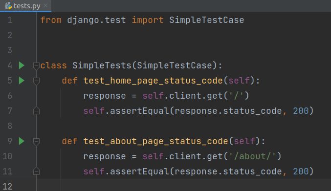
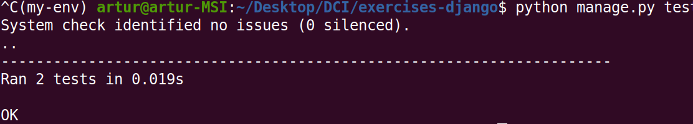
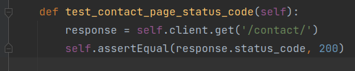
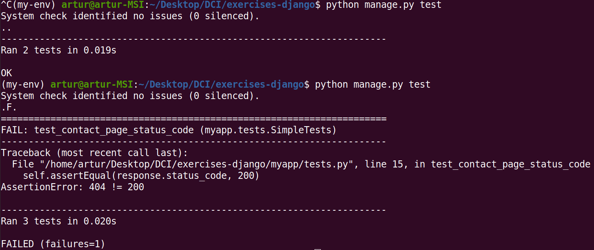
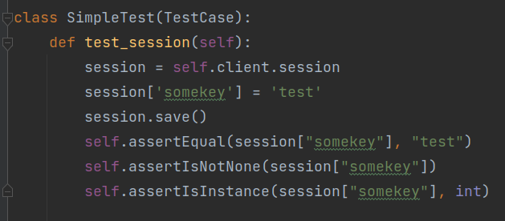
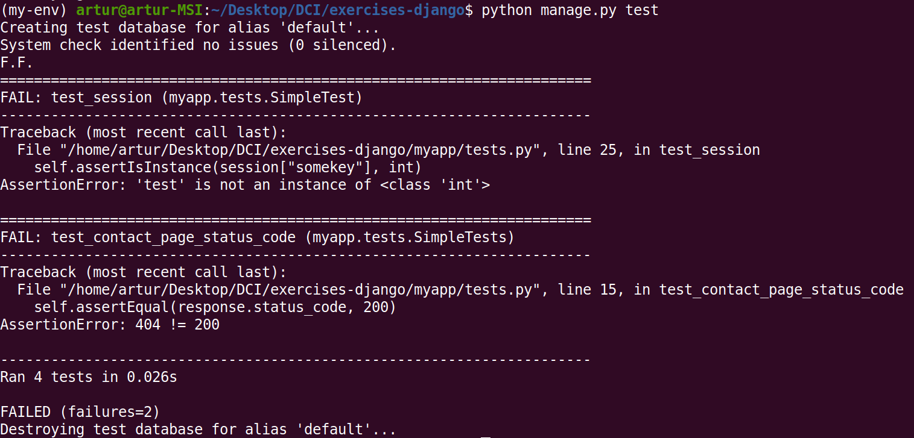

# Testing in Django  

## Tasks
1. It's time to add some [tests](https://docs.djangoproject.com/en/3.2/topics/testing/) to our application.
*  Jacob Kaplan-Moss (one of Django’s original creators) - "Code without tests is broken as designed".
*  The default startapp template creates a ```tests.py``` file in the new application. This might be fine if you only have a few tests, but as your test suite grows you’ll likely want to restructure it into a tests package so you can split your tests into different submodules such as test_models.py, test_views.py, test_forms.py, etc.

* Writing tests is important because it automates the process of confirming that the
code works as expected. Fortunately Django comes with robust, built-in testing tools for writing and running tests.

* **Don't forget to activate you virtualenv!**  

2. Testing with SimpleTestCase
*  Read the documentation of Django's [SimpleTestCase](https://docs.djangoproject.com/en/3.2/topics/testing/tools/#django.test.SimpleTestCase). It is recommended testing tool, when we **don't** work with databases. If you are using a database, then instead use [TestCase](https://docs.djangoproject.com/en/3.2/topics/testing/tools/#testcase).

* create class SimpleTests that derives from built-in SimpleTestCase class. In this class:
      * create method ```test_home_page_status_code``` to test status of starting page of the project ('/')
      * create method ```test_about_page_status_code``` to test status of starting page of the project ('/')  
           


* run tests with command ```python manage.py test``` 
           

* write test for the page that doesn't exist, for example ```contact/``` page. 
           
* again run tests with command ```python manage.py test``` 
           

* it's a standard procedure in [Test-Driven Development](https://en.wikipedia.org/wiki/Test-driven_development) (TDD) methodology to write a test that fails at the beginning. Then we should write the simplest code to pass the tests, and finally refactor code as needed.

2. Testing with TestCase 
* [TestCase](https://docs.djangoproject.com/en/3.2/topics/testing/tools/#testcase) is the most common class to use for writing tests in Django.

* we haven't covered databases yet, so for now we'll use TestCase only to test session data.
* read documentation of [assert methods](https://docs.python.org/3/library/unittest.html#assert-methods).

* use documentation of [Client.session](https://docs.djangoproject.com/en/3.2/topics/testing/tools/#persistent-state) and write at least three tests of session data with different assert methods.
           
         
* do some experiments with tests, for example by setting good or wrong values in asserts.
           

## Input/Output:
```
Working with SimpleTestCase (not for databases) and with TestCase testing tools in Django.
```