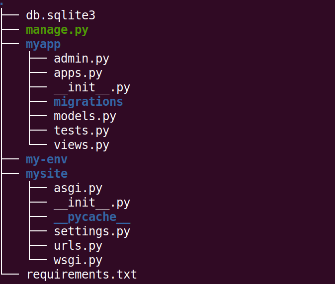
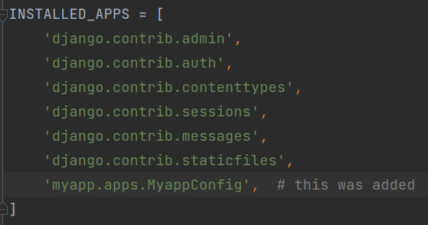
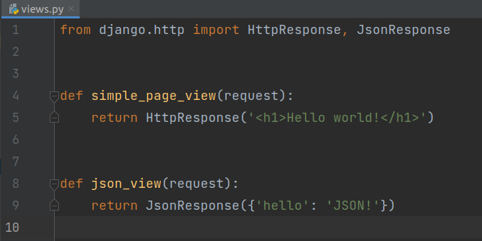
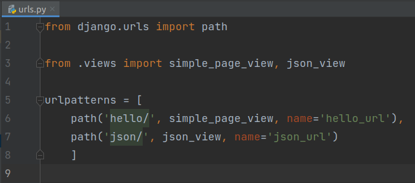
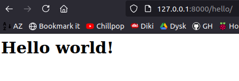
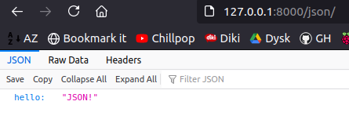

# Urls and routing in Django 

## Tasks
1. So far we have created virtual environment inside 'django-exercise' folder and we have project named 'mysite'.  
   **After command ```ls -l``` you should have ```manage.py``` file on your list!  
    It means that you are inside 'mysite' project.  
    Don't forget to activate you virtualenv!**

2. Create app with name 'myapp':    
```python manage.py startapp myapp```  
- at this moment structure of folders and files in folder 'exercises-django' should look as follows:  


3. Add information about your app to INSTALLED_APPS list in ```settings.py``` configuration file:  

   

4. In ```views.py``` file of your ```myapp``` app create  function based view, that returns HttpResponse object. In the same file create  function based view, that returns JsonResponse object: 

   

5. In your app (myapp) folder create file ```urls.py``` (app-level urls). Import previously created views and create two different paths (for both views, for example 'hello/' and 'json/'):    
   

6. In your project (mysite) folder update ```urls.py``` file (project-level urls) by adding information about urls from your app. Use ```include()``` function:  
   


7. Run development server:  
```python manage.py runserver```  

8. Open link ```http://127.0.0.1:8000/hello/``` in the browser. After URL of development server type path of your first URL from 'myapp/urls.py' (we have 'hello/' in this example). It works if you see the value returned in the first view:

     

9. Open link ```http://127.0.0.1:8000/json/``` in the browser. After URL of development server type path of your second URL from 'myapp/urls.py' (we have 'json/' in this example). It works if you see the value returned in the second view (in JSON format):

    

## Input/Output:
```
Working urls with proper views returning HttpResponse and JsonResponse objects.
```