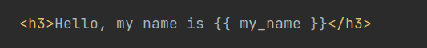

# Views and templating in Django  

## Tasks
1. So far we have created virtual environment inside 'django-exercise' folder and we have project named 'mysite' with app named 'myapp'.  
*  App handles two urls (both in  app's ```urls.py``` file ), and each url allows user for calling specific view (from ```views.py``` file).  
*  Both views return simple response object (HttpRespons or JsonResponse) with hardcoded values.  

*  **Don't forget to activate you virtualenv!**  

2. Create app-level template ```base.html``` in ```myapp/templates/myapp/``` directory.  
*  You can use elements from [ready-to-use](https://startbootstrap.com/template/bare)  templates or just create HTML file with [basic](https://developer.mozilla.org/en-US/docs/Learn/HTML/Introduction_to_HTML/Document_and_website_structure) structure.   
*  For now use only HTML. Add some paragraphs  and headers to ```body``` section and empty [block](https://docs.djangoproject.com/en/3.2/ref/templates/builtins/#block) for overriding by child templates (name this block 'content'):  

     
CSS and JavaScript files will be added later. 
* at this moment structure of folders and files in folder 'exercises-django' should look as follows:  


3. Create next app-level template ```about.html``` in the same ```myapp/templates/myapp/``` directory. Use template  extending of ```base.html``` template. Add few HTML tags inside 'content' block.  
Hint: use [extends](https://docs.djangoproject.com/en/3.2/ref/templates/builtins/#extends) template tag.  

   

4. In ```views.py``` file of your ```myapp``` app:  
* add another  function based view (named for example ```base_view```), that uses [render](https://docs.djangoproject.com/en/3.2/topics/http/shortcuts/#render) function with previously created template ```base.html```,
* add class based view (named for example ```AboutView```), that uses previously created template ```about.html```,
*  Hint: you can use [TemplateView](https://docs.djangoproject.com/en/3.2/topics/class-based-views/).

   

5. Update your app-level ```urls.py```. Import created views and create two different paths (for both views, for example '' and 'about/'):    
   

6. Run development server to check if recently added added urls work:  
```python manage.py runserver```  

*  Check links ```http://127.0.0.1:8000/``` and ```http://127.0.0.1:8000/about/``` in the browser.   You should see something similar to following picture:

     

7. In the ```base.html``` template add links to other created pages using [url](https://docs.djangoproject.com/en/3.2/ref/templates/builtins/#url) template tag:

    

*  the page could look like this:  
    

8. Adding static files to project:
*  create folder ```static``` at the project level and create two folders inside it: ```css``` and ```js```.  
In ```css``` folder create ```base.css``` file and in ```js``` folder create ```base.js``` file:  
   

* add information about ```static``` folder to setting [STATICFILES_DIRS](https://docs.djangoproject.com/en/3.2/ref/settings/#std:setting-STATICFILES_DIRS) in ```settings.py``` configuration file.  
 

  Some useful hints could be found [here](https://adamj.eu/tech/2020/03/16/use-pathlib-in-your-django-project/).

* in ```base.css``` add rule for changing color of all (or selected) paragraphs to red.  

   

* in ```base.js``` add rule for changing color of all (or selected) specific headers to green. 
   

* if everything works fine, you should see effects of your changes:  
   

9. Passing data to template context.  
* look on examples in documentation of [render](https://docs.djangoproject.com/en/3.2/topics/http/shortcuts/#render) function and in ```base_view``` use dictionary to create key-value pair with string ```my_name``` as a key and your name as a value,

* use this dictionary as a first optional argument in ```render``` function to pass it to given template,
   


* in template ```base.html``` use [variable](https://docs.djangoproject.com/en/3.2/topics/templates/#variables) in ```<body>``` section to get the value from the context:
   

* you should see value from template context displayed in the browser:
   


## Input/Output:
```
Working urls, views and templates with static (CSS and JavaScript) files.
```