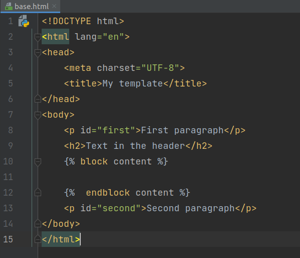
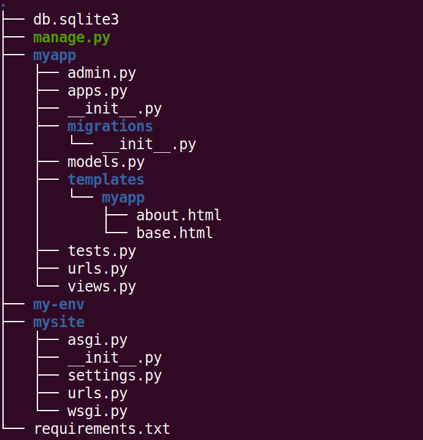
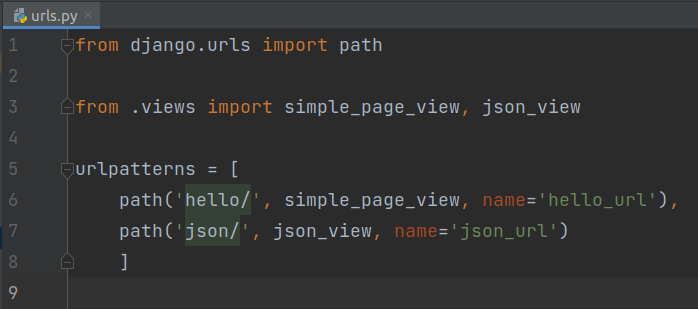
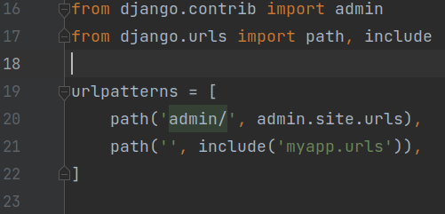
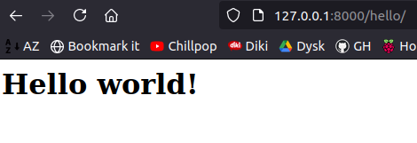

# Views and templating in Django  

## Tasks
1. So far we have created virtual environment inside 'django-exercise' folder and we have project named 'mysite' with app named 'myapp'. App handles two urls (both in  app's ```urls.py``` file ), and each url allows user for calling specific view (from ```views.py``` file). Both views return simple response object (HttpRespons or JsonResponse) with hardcoded values.  
   **Don't forget to activate you virtualenv!**

2. Create app-level template ```base.html``` in ```myapp/templates/myapp/``` directory.  
You can use elements from [ready-to-use](https://startbootstrap.com/template/bare)  templates or just create HTML file with [basic](https://developer.mozilla.org/en-US/docs/Learn/HTML/Introduction_to_HTML/Document_and_website_structure) structure.   
For now use only HTML. Add some paragraphs  and headers to ```body``` section, for example:  

     
CSS and JavaScript files will be added later. 
- at this moment structure of folders and files in folder 'exercises-django' should look as follows:  


3. Create next app-level template ```about.html``` in the same ```myapp/templates/myapp/``` directory by extending ```base.html``` template.  
Hint: use [extends](https://docs.djangoproject.com/en/3.2/ref/templates/builtins/#extends) template tag:

4. In ```views.py``` file of your ```myapp``` app:  
* add another  function based view (named for example ```base_view```), that uses [render](https://docs.djangoproject.com/en/3.2/topics/http/shortcuts/#render) function with previously created template ```base.html```,
* add class based view (named for example ```about_view```), that uses previously created template```about.html```: 

   

5. Update your app-level ```urls.py```. Import created views and create two different paths (for both views, for example 'hello/' and 'json/'):    
   

6. In your project (mysite) folder update ```urls.py``` file by adding information about urls from your app. Use ```include()``` function:  
   


7. Run development server:  
```python manage.py runserver```  

8. Open link ```http://127.0.0.1:8000/hello/``` in the browser. After URL of development server type path of your first URL from 'myapp/urls.py' (we have 'hello/' in this example). It works if you see the value returned in the first view:

     

9. Open link ```http://127.0.0.1:8000/json/``` in the browser. After URL of development server type path of your second URL from 'myapp/urls.py' (we have 'json/' in this example). It works if you see the value returned in the second view (in JSON format):

    

## Input/Output:
```
Working urls with proper views returning HttpResponse and JsonResponse objects.
```